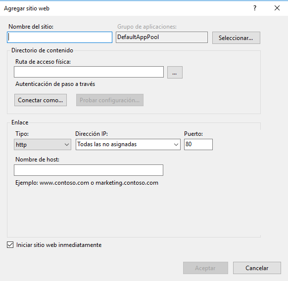

A continuación, voy a contar como he desplegado una aplicación hecha con React JS y publicarla en un IIS.

Se va a dar por supuesto que ya tienes creada la aplicación.


## Crear un sitio en IIS

Primero debemos añadir un sitio en el IIS, para ello, en el árbol de sitios del IIS, botón derecho del ratón, nuevo sitio.



Añadimos el nombre del sitio, el directorio donde se alojarán los ficheros de nuestra web y la URL asignada a nuestro sitio.

Y listo, ya tenemos creado nuestro nuevo sitio en el IIS


## Crear despliegue optimizado para producción en React 

Una vez, creado nuestro sitio en el IIS, tenemos que proporcionarle nuestros ficheros que contienen a nuestra web, para ello en React se crea una versión optimizada para producción con el comando 

```
npm run build
```

Este comando te creará una serie de archivos en una carpeta llamada build que serán los que copiaremos en la carpeta asignada anteriormente en el IIS como ruta de acceso física.


## Web.config para evitar el error 404 en páginas de React en el IIS

El **error 404 en React** surge al moverte por tu sitio y actualizar la página fuera de la principal, eso es debido porque en una aplicación de React no existen más páginas que el index, internamente ella se encarga de mostrar las diferentes "páginas" , por ejemplo, a través del componente <a href="https://reactrouter.com/">React Router</a>.


Por lo tanto, una configuración muy importante que tiene que tener nuestro sitio de React en el IIS es la **redirección de todas las URLs a la página index.html** de nuestro sitio y eso se consigue a través del fichero web.config.

El fichero web.config es necesario para proporcionar configuraciones a nuestro sitio del IIS y se sitúa en la raíz de nuestra carpeta física de nuestro sitio del IIS.

Así que nuestro fichero web.config quedará así:


```
<?xml version="1.0" encoding="UTF-8"?>
<configuration>
  <system.webServer>
    <rewrite>
      <rules>
        <rule name="ReactRouter Routes" stopProcessing="true">
          <match url=".*" />
          <conditions logicalGrouping="MatchAll">
              <add input="{REQUEST_FILENAME}" matchType="IsFile" negate="true" />
              <add input="{REQUEST_FILENAME}" matchType="IsDirectory" negate="true" />
          </conditions>
          <action type="Rewrite" url="/index.html" />
        </rule>
      </rules>
    </rewrite>
  </system.webServer>
</configuration>
```

Si quisiéramos evitar el redireccionamiento de alguna URL en concreto, por ejemplo, la de nuestra API, podría quedar nuestro fichero index.config así:

```
<?xml version="1.0" encoding="UTF-8"?>
<configuration>
  <system.webServer>
    <rewrite>
      <rules>
        <rule name="ReactRouter Routes" stopProcessing="true">
          <match url=".*" />
          <conditions logicalGrouping="MatchAll">
              <add input="{REQUEST_URI}" negate="true" pattern="^/api" ignoreCase="true" />
              <add input="{REQUEST_FILENAME}" matchType="IsFile" negate="true" />
              <add input="{REQUEST_FILENAME}" matchType="IsDirectory" negate="true" />
          </conditions>
          <action type="Rewrite" url="/index.html" />
        </rule>
      </rules>
    </rewrite>
  </system.webServer>
</configuration>
```

## Conclusión

Como conclusión, podemos ver que lo fácil que es publicar una aplicación de React en el IIS, solo hay que tener en cuenta esa redirección en el fichero web.config para que funcione correctamente nuestro sitio.

