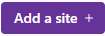

A continuación, voy a contar como he creado un blog personal, esté que estás leyendo con Gatsby y como subirlo a la propia nube de Gatsby de forma gratuita.

## ¿Qué es Gatsby JS?

<a href="https://www.gatsbyjs.com/" target="_blank">Gatsby</a> es un rápido y flexible framework de React donde se pueden construir páginas webs estáticas de forma muy rápida y sencilla. Al ser estáticas no requiere de una base de datos por lo que el contenido se carga de forma muy rápida y no necesitas un hosting de grandes prestaciones, de hecho, puedes subir tu blog de forma gratuita a su nube.

Además, cuenta con varias plantillas de tipos como Blog, Portafolio e integraciones con varios CMS donde está prácticamente todo configurado a falta de tus personalizaciones y usa la tecnología <a href="https://es.wikipedia.org/wiki/Markdown" target="_blank">Markdown</a> para escribir los artículos y <a href="https://graphql.org/" target="_blank">GraphQL</a> para realizar consultas sobre tu contenido estático.


Por último, Gatsby Cloud usa como repositorio de código GitHub, GitLab o Bitbucket, se conecta internamente y por cada push te crea una nueva compilación.

## ¿Cómo programar un blog con Gatsby?

Lo primero, debemos tener instalado en nuestro sistema <a href="https://nodejs.org/es/" target="_blank">Node.js</a> y el IDE que más te guste, por ejemplo, Visual Studio Code y Git con una cuenta en GitHub, GitLab o Bitbucket. 

Con todo listo, accedemos a la página de Gatsby y nos registramos usando cualquiera de sus métodos. Una vez dentro nos aparecerá nuestro panel de sitios, de los cuales podemos tener uno de forma gratuita y pulsamos sobre el botón Add a site 

Ahora nos permite elegir el repositorio de código a utilizar, el cual nos pedirá que otorguemos permisos para poder conectar con él y si queremos usar alguna plantilla, utilizaremos en este ejemplo "Gatsby Starter Blog".

Una vez configurado, nos creará un nuevo repositorio con el nombre que hayamos seleccionado y nos mostrará el panel de nuestros sitios en Gatsby.


### Editar y ejecutar el blog creado en Gatsby Cloud de forma local

Para poder ejecutar aplicaciones creadas con Gatsby debemos tener instalado su cliente, para ello usaremos el repositorios de paquetes npm a través de la consola de Windows usando el siguiente comando.
```
npm i -g gatsby-cli
```

También, evidentemente, tenemos que tener nuestro código del blog de forma local por lo que nos traemos una copia de nuestro repositorio usando Git.


```
git clone URL_DE_TU_BLOG
```

Ahora, al ser un entorno de node, debemos instalar todas la librerías que usa nuestro proyecto, por lo que, accedemos a la carpeta que descargamos anteriormente y ejecutamos 

```
npm install
```

¡Ya está todo listo! Solo nos queda levantar el servidor para poder ver nuestra aplicación en el navegador, para ello utilizaremos el comando


```
gatsby develop URL_DE_TU_BLOG
```

Y ya podremos acceder a nuestro blog a través de la URL http://localhost:8000

### Desplegar en Gatsby Cloud

Para desplegar tu aplicación en Gatsby Cloud tan solo tienes que realizar un Push a tu repositorio, el solo se encarga de compilar el nuevo código y desplegar en su nube.

```
git push
```

### Apuntar tu dominio al blog

Este paso es opcional, pero si quieres tener un blog más profesional deberías comprar un dominio y referenciarlo al blog.

Para ello, en Gatsby Cloud, debes de acceder a al dashboard y al sitio en concreto, Site Settings (arriba a la derecha), Hosting (a la izquierda), Add domain.

Al añadir tu dominio, aparecen dos IPs asignadas a tu blog, debajo de "Please update your DNS records to validate domain(s)". Debes usar cualquiera de ellas para configurarla en el apartado DNS del panel de configuración donde compraste el dominio.

### Conclusión

Como conclusión, me ha parecido una forma muy fácil y económica, ya que solo pagarías el dominio, si es que lo quieres, de programar tu propio blog y desplegarlo al mundo. Además al no utilizar una base de datos se siente mucho más rápido de crear pero sin perder la gracia de poder hacer consultas de tus propios post al poder utilizar GraphQL.

La opción de poder desplegarlo a Gatsby Cloud de forma gratuita y de forma tan sencilla, es un puntazo.